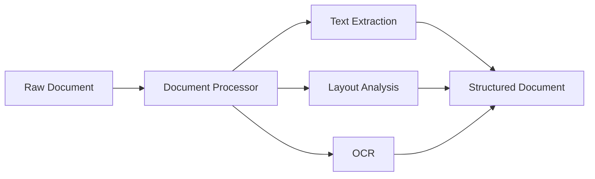
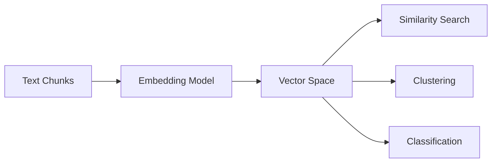

This page covers the fundamental concepts of the Aurelio SDK, explaining its key components and how they work together to provide powerful document processing capabilities.

## Document Processing

Document processing in the Aurelio SDK converts unstructured documents (PDFs) into easily readable markdown that can be further processed or used in AI applications.



The processing pipeline:

1. **Ingestion**: Documents are uploaded either as local files or via URLs.
2. **Quality Selection**: Processing can be done in different quality modes:
   - `low`: Faster but less accurate
   - `high`: More accurate but slower
3. **Text Extraction**: The system identifies and extracts text content
4. **Structure Recognition**: Identifies document elements like headers, paragraphs, tables
5. **Metadata Extraction**: Retrieves document metadata when available

```python
# Example of document processing
response = client.extract_file(
    file_path="document.pdf", 
    quality="high",
    wait=30
)
```

## Chunking

Chunking is the process of breaking long documents into smaller, semantically meaningful pieces that are optimized for downstream tasks like embedding and retrieval.


### Why Chunking Matters

1. **Token Limitations**: Most embedding models have maximum context windows
2. **Semantic Coherence**: Properly chunked documents maintain meaning and context
3. **Retrieval Precision**: Well-defined chunks improve retrieval accuracy
4. **Processing Efficiency**: Smaller chunks reduce computational overhead

The SDK supports different chunking strategies:

- **Semantic Chunking**: Creates chunks based on semantic boundaries (paragraphs, sections)
- **Fixed-Size Chunking**: Creates chunks of approximately equal size
- **Custom Chunking**: Configure chunking parameters to suit specific needs

```python
# Example of custom chunking
chunking_options = ChunkingOptions(
    chunker_type="semantic",
    max_chunk_length=400,
    window_size=5
)

chunk_response = client.chunk(
    content=long_text, 
    processing_options=chunking_options
)
```

## Embedding

Embeddings are dense vector representations of text that capture semantic meaning in a form that machines can process efficiently. They enable semantic search, similarity comparison, and other NLP applications.



### Embedding Applications

1. **Semantic Search**: Find contextually similar content beyond keyword matching
2. **Information Retrieval**: Retrieve relevant document sections for RAG applications
3. **Document Similarity**: Compare documents based on meaning rather than exact wording
4. **Content Organization**: Cluster similar content automatically

The SDK supports multiple embedding models to suit different needs and balance between quality and performance.

```python
# Example of generating embeddings
embedding_response = client.embedding(
    input=chunk_texts,
    model="bm25"  # Choose embedding model based on needs
)
```

## Async vs Sync Approaches

The Aurelio SDK offers both synchronous and asynchronous APIs to accommodate different usage patterns.


### When to Use Synchronous API

- **Simple Scripts**: For straightforward, linear processing flows
- **Small Documents**: When processing time is minimal
- **Development/Testing**: During initial development or debugging
- **Single Document Processing**: When handling one document at a time

```python
# Synchronous API example
client = AurelioClient(api_key=os.environ["AURELIO_API_KEY"])
response = client.extract_file(file_path="document.pdf", wait=30)
```

### When to Use Asynchronous API

- **Production Applications**: For high-throughput systems
- **Large Documents**: When processing may take significant time
- **Batch Processing**: When handling multiple documents simultaneously
- **Web Applications**: To prevent blocking the main thread

```python
# Asynchronous API example
async_client = AsyncAurelioClient(api_key=os.environ["AURELIO_API_KEY"])
async def process_document():
    response = await async_client.extract_file(file_path="document.pdf")
    return response
```

The async API provides significant performance improvements for concurrent processing scenarios, making it the preferred choice for production applications with substantial throughput requirements.