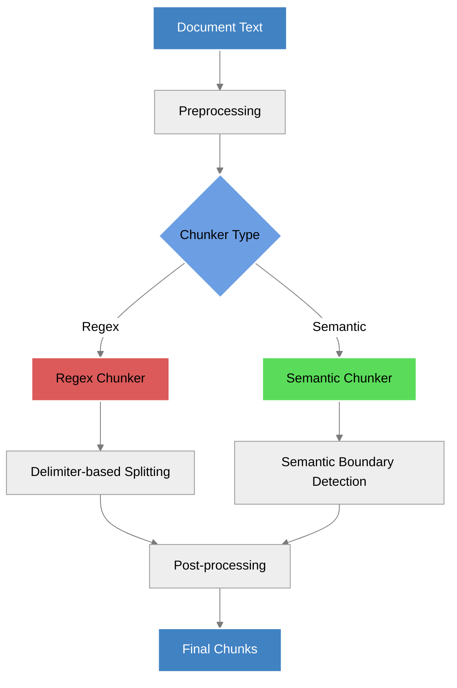
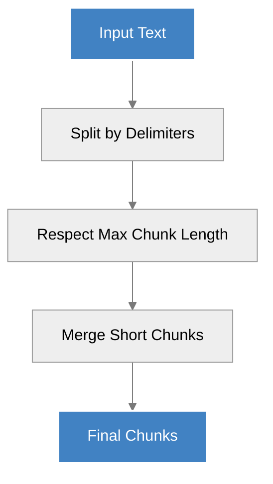
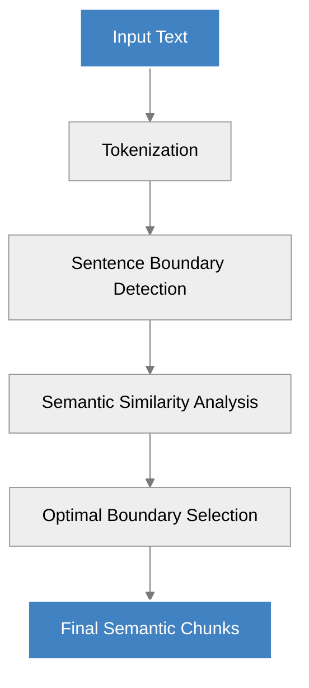
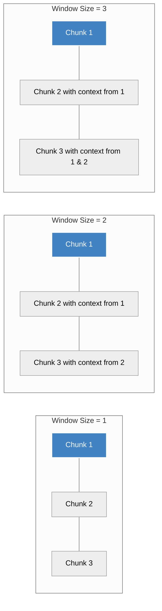

This guide provides detailed technical information about document chunking capabilities in the Aurelio SDK. Chunking is the process of dividing a document into smaller, semantically meaningful segments for improved processing and retrieval.

## Chunking Flow



## Chunking Options

The SDK provides a flexible chunking API with several configurable parameters:

```python
class ChunkingOptions(BaseModel):
    max_chunk_length: Optional[int] = Field(
        default=400, description="The maximum chunk length for the chunker"
    )
    chunker_type: Optional[Literal["regex", "semantic"]] = Field(
        default="regex",
        description="The chunker type, either regex or semantic",
    )
    window_size: Optional[int] = Field(
        default=1, description="The window size for the semantic chunker"
    )
    delimiters: Optional[List[str]] = Field(
        default_factory=list,
        description="Optional. The regex delimiters for the regex chunker",
    )
```

| Parameter | Type | Default | Description |
|-----------|------|---------|-------------|
| `max_chunk_length` | `int` | `400` | Maximum number of tokens per chunk |
| `chunker_type` | `str` | `"regex"` | Chunking algorithm: `"regex"` or `"semantic"` |
| `window_size` | `int` | `1` | Context window size for semantic chunking |
| `delimiters` | `List[str]` | `[]` | Custom regex delimiters for regex chunking |

## Chunking Methods

The SDK offers two primary methods for chunking documents:

1. **Direct chunking** of text content via the `chunk` function
2. **Chunking during file processing** via the []`extract` function](file-extraction)

### Direct Text Chunking

```python
def chunk(
    self,
    content: str,
    max_chunk_length: int = 400,
    chunker_type: Literal["regex", "semantic"] = "regex",
    window_size: int = 1,
    delimiters: Optional[List[str]] = None,
) -> ChunkResponse:
    """Chunk text content into smaller, semantically-meaningful segments."""
```

#### Usage Example

```python
from aurelio_sdk import AurelioClient

client = AurelioClient()

text = """
Long document text that needs to be chunked into smaller segments.
This could be multiple paragraphs of content that would benefit from
semantic chunking for better processing downstream.
"""

response = client.chunk(
    content=text,
    max_chunk_length=300,
    chunker_type="semantic",
    window_size=2
)

# Access the chunks
for chunk in response.document.chunks:
    print(f"Chunk {chunk.chunk_index}: {chunk.content[:50]}...")
    print(f"Token count: {chunk.num_tokens}")
```

### Chunking During Extraction

When processing files, chunking can be enabled with the `chunk=True` parameter:

```python
response = client.extract_file(
    file_path="document.pdf",
    quality="high",
    chunk=True  # Enable chunking
)

# Access the chunks from the extraction response
for chunk in response.document.chunks:
    print(f"Chunk {chunk.chunk_index}: {chunk.content[:50]}...")
```

## Chunking Algorithms

The SDK supports two chunking algorithms, each with different characteristics and use cases.

### Regex Chunking

The default chunking method uses regular expressions to split text based on delimiters.



**Key characteristics:**
- Fast and deterministic
- Respects natural text boundaries like paragraphs
- Works well for well-structured documents
- Less compute-intensive than semantic chunking

**Best for:**
- Well-formatted text with clear paragraph breaks
- Large volumes of documents where processing speed is important
- Situations where chunk boundaries are less critical

**Example with custom delimiters:**

```python
response = client.chunk(
    content=long_text,
    max_chunk_length=500,
    chunker_type="regex",
    delimiters=["\n\n", "\n###\s+", "\n##\s+", "\n#\s+"]  # Custom delimiters
)
```

### Semantic Chunking

A more advanced algorithm that attempts to preserve semantic meaning across chunk boundaries.



**Key characteristics:**
- Preserves semantic meaning across chunks
- More compute-intensive than regex chunking
- Creates more coherent chunks for complex content
- Better respects topical boundaries

**Best for:**
- Complex documents where semantic coherence is important
- Content that will be used for semantic search or LLM context
- Documents with varied formatting where regex may struggle

**Example with window size:**

```python
response = client.chunk(
    content=complex_text,
    max_chunk_length=400,
    chunker_type="semantic",
    window_size=3  # Use larger context window for better semantic boundaries
)
```

The `window_size` parameter controls how much surrounding context is considered when determining chunk boundaries. Larger values preserve more context but increase processing time.

## Window-Based Processing

Semantic chunking uses a sliding window approach to maintain context across chunk boundaries.



### Impact of Window Size

| Window Size | Context Preservation | Processing Speed | Use Case |
|-------------|----------------------|------------------|----------|
| 1 (default) | Minimal | Fastest | Basic chunking needs |
| 2-3 | Moderate | Medium | Balanced approach |
| 4+ | Maximum | Slower | High-precision needs |

## Response Structure

The chunking response provides detailed information about each generated chunk:

```python
class ChunkResponse(BaseModel):
    status: TaskStatus = Field(..., description="The status of the chunking process")
    usage: Usage = Field(..., description="Usage")
    message: Optional[str] = Field(None, description="Message")
    processing_options: ChunkingOptions = Field(
        ..., description="The processing options for the chunker"
    )
    document: ResponseDocument = Field(..., description="Processed document")
```

Each chunk contains:

```python
class ResponseChunk(BaseModel):
    id: str = Field(..., description="ID of the chunk")
    content: str = Field(..., description="Content of the chunk")
    chunk_index: int = Field(..., description="Index of the chunk in the document")
    num_tokens: int = Field(..., description="Number of tokens in the chunk")
    metadata: Dict[str, Any] = Field(
        default_factory=dict, description="Metadata of the chunk"
    )
```

## Recommendations for Effective Chunking

### General Guidelines

- **Choose the right algorithm**: Use `regex` for speed, `semantic` for meaning preservation
- **Set appropriate chunk sizes**: 300-500 tokens works well for most applications
- **Customize for your content**: Adjust parameters based on document structure

### By Content Type

| Content Type | Recommended Chunker | Max Chunk Length | Window Size | Notes |
|--------------|---------------------|------------------|-------------|-------|
| Technical documentation | `regex` | 400 | 1 | Often has clear section breaks |
| Academic papers | `semantic` | 350 | 2 | Complex ideas need semantic coherence |
| Legal documents | `semantic` | 300 | 3 | Precise context preservation is critical |
| News articles | `regex` | 450 | 1 | Well-structured with clear paragraphs |
| Transcripts | `semantic` | 500 | 2 | Spoken language benefits from semantic boundaries |

### Performance Considerations

- Regex chunking is significantly faster (5-10x) than semantic chunking
- Processing time increases with document size and window size
- For very large documents (>1MB of text), consider preprocessing into smaller segments

## Advanced Usage: Custom Delimiters

For regex chunking, you can provide custom delimiters to better match your document structure:

```python
# Custom delimiters for Markdown documents
markdown_delimiters = [
    "\n##\s+",  # ## Headers
    "\n###\s+",  # ### Headers
    "\n\n",      # Double line breaks
    "\n\*\*\*\n" # *** Horizontal rules
]

response = client.chunk(
    content=markdown_text,
    chunker_type="regex",
    delimiters=markdown_delimiters
)
```

Common delimiter patterns:

- **Headers**: `"\n#{1,6}\s+"` (matches Markdown headers)
- **Paragraphs**: `"\n\s*\n"` (matches paragraph breaks)
- **List items**: `"\n\s*[-*•]\s"` (matches list markers)
- **Sections**: `"\n\d+\.\s+"` (matches numbered sections)

## Error Handling

```python
from aurelio_sdk import AurelioClient, APIError

client = AurelioClient()

try:
    response = client.chunk(
        content=very_long_text,
        max_chunk_length=300,
        chunker_type="semantic"
    )
except APIError as e:
    print(f"Chunking error: {e.message}")
    # Fallback to regex chunking
    response = client.chunk(
        content=very_long_text,
        max_chunk_length=300,
        chunker_type="regex"
    )
``` 