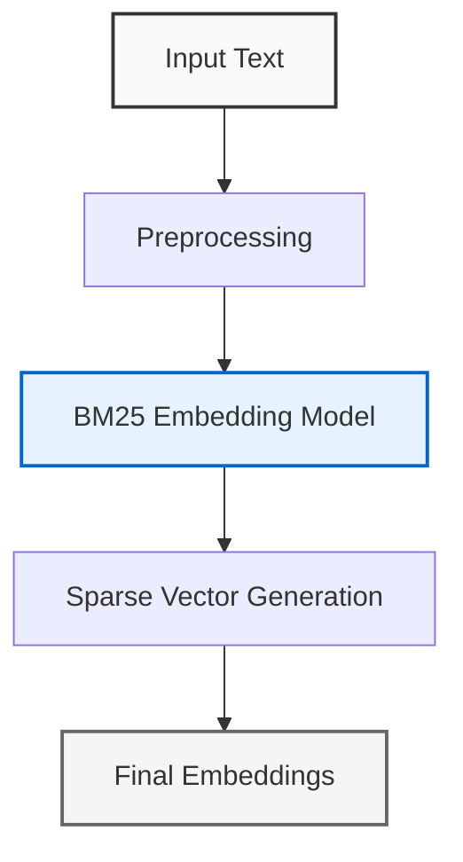
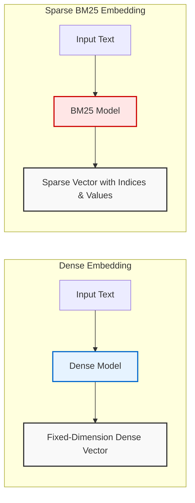
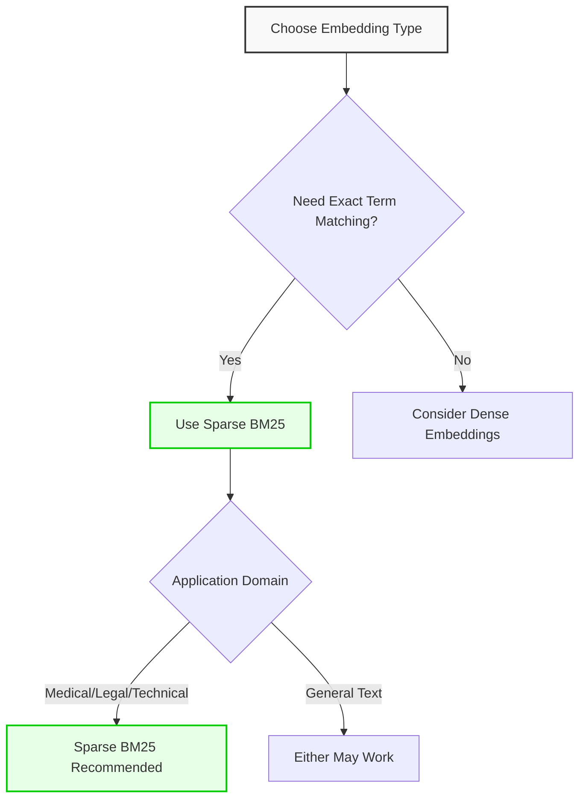

This guide provides detailed technical information about embedding capabilities in the Aurelio SDK. Embeddings are vector representations of text that capture semantic meaning and are essential for building text retrieval and search systems.

## Embedding Flow



## Embedding Options

The SDK provides a focused embedding API with the following parameters:

```python
def embedding(
    self,
    input: Union[str, List[str]],
    input_type: Annotated[str, Literal["queries", "documents"]],
    model: Annotated[str, Literal["bm25"]],
    timeout: int = 30,
    retries: int = 3,
) -> EmbeddingResponse:
    """Generate embeddings for the given input using the specified model."""
```

| Parameter | Type | Default | Description |
|-----------|------|---------|-------------|
| `input` | `Union[str, List[str]]` | Required | Text or list of texts to embed |
| `input_type` | `str` | Required | Either "queries" or "documents" depending on use case |
| `model` | `str` | `"bm25"` | Embedding model to use (currently only "bm25" is available) |
| `timeout` | `int` | `30` | Maximum seconds to wait for API response |
| `retries` | `int` | `3` | Number of retry attempts for failed requests |

## Sparse Embeddings

The Aurelio SDK uses sparse BM25-style embeddings, which differ from traditional dense embeddings:



### Aurelio Sparse Implementation

The SDK's BM25 embedding model uses a single set of pretrained weights trained on a web-scale dataset to produce a "world model" set of BM25-like weights. These weights are transformed into sparse vector embeddings with the following characteristics:

- **Structure**: Each embedding contains index-value pairs, where indices represent specific terms/tokens and values represent their importance
- **Sparse Representation**: Only non-zero values are stored, making them memory-efficient
- **Exact Term Matching**: Excellent for capturing exact terminology for specialized domains
- **Domain-Specific Performance**: Well-suited for finance, medical, legal, and technical domains where specific terminology matters

### Input Types

The `input_type` parameter accepts two possible values:

| Input Type | Use Case | Description |
|------------|----------|-------------|
| `"documents"` | Creating a searchable knowledge base | Optimizes embeddings for document representation in a vector database |
| `"queries"` | Querying a knowledge base | Optimizes embeddings for query representation when searching against embedded documents |

### Sparse Embedding Structure

```python
class SparseEmbedding(BaseModel):
    indices: list[int]
    values: list[float]
```

The `indices` correspond to token positions in the vocabulary, while the `values` represent the importance of each token for the given text.

## Usage Examples

### Basic Embedding Generation

```python
from aurelio_sdk import AurelioClient

client = AurelioClient(api_key="your_api_key")

# Embedding a single text
response = client.embedding(
    input="What is the capital of France?", 
    input_type="queries",
    model="bm25"
)

# Accessing the embedding
embedding = response.data[0].embedding
print(f"Indices: {embedding.indices[:5]}...")
print(f"Values: {embedding.values[:5]}...")
```

### Batch Embedding Generation

```python
# Embedding multiple documents at once
documents = [
    "Paris is the capital of France.",
    "Berlin is the capital of Germany.",
    "Rome is the capital of Italy."
]

response = client.embedding(
    input=documents,
    input_type="documents",
    model="bm25"
)

# Process each embedding
for i, item in enumerate(response.data):
    embedding = item.embedding
    print(f"Document {i}: {len(embedding.indices)} non-zero elements")
```

### Async Embedding Generation

```python
from aurelio_sdk import AsyncAurelioClient
import asyncio

async def generate_embeddings():
    client = AsyncAurelioClient(api_key="your_api_key")
    
    response = await client.embedding(
        input="Async embedding generation", 
        input_type="documents",
        model="bm25"
    )
    
    return response

embeddings = asyncio.run(generate_embeddings())
```

## Complete Workflow: Chunk and Embed

A common pattern is to chunk documents and then embed each chunk:

```python
# 1. Extract and chunk a document
extract_response = client.extract_file(
    file_path="document.pdf", 
    quality="high",
    chunk=True
)

# 2. Get chunks from the document
chunks = [chunk.content for chunk in extract_response.document.chunks]

# 3. Generate embeddings for all chunks
embedding_response = client.embedding(
    input=chunks,
    input_type="documents",
    model="bm25"
)

# Now you can store these embeddings in a vector database
for i, chunk in enumerate(extract_response.document.chunks):
    embedding = embedding_response.data[i].embedding
    # Store chunk ID, content, and embedding in your vector store
```

## Response Structure

The embedding response contains detailed information:

```python
class EmbeddingResponse(BaseModel):
    message: Optional[str]
    model: str      # The model used (e.g., "bm25")
    object: str     # Always "list"
    usage: EmbeddingUsage
    data: list[EmbeddingDataObject]
```

The `EmbeddingUsage` provides token consumption metrics:

```python
class EmbeddingUsage(BaseModel):
    prompt_tokens: int
    total_tokens: int
```

Each embedding is contained in an `EmbeddingDataObject`:

```python
class EmbeddingDataObject(BaseModel):
    object: str     # Always "embedding"
    index: int      # Position in the input array
    embedding: SparseEmbedding
```

## Advantages of Sparse Embeddings

### Sparse vs. Dense Embeddings

| Characteristic | Sparse BM25 Embeddings | Dense Embeddings |
|----------------|------------------------|------------------|
| Representation | Index-value pairs for non-zero elements | Fixed-dimension vectors of continuous values |
| Storage Efficiency | High (only stores non-zero values) | Low (stores all dimensions) |
| Term Matching | Excellent for exact term/keyword matching | May miss exact terminology |
| Domain Adaptation | Strong for specialized vocabulary domains | May require fine-tuning for domains |
| Interpretability | Higher (indices correspond to vocabulary terms) | Lower (dimensions not directly interpretable) |

### When to Use Sparse



Sparse BM25 embeddings excel in scenarios where:

- You need to capture domain-specific terminology (medical, finance, legal, technical)
- Exact keyword matching is important
- You want higher interpretability of search results
- You're building systems where precision on terminology matters more than general semantic similarity

## Error Handling

```python
from aurelio_sdk import AurelioClient, ApiError, ApiTimeoutError

client = AurelioClient(api_key="your_api_key")

try:
    response = client.embedding(
        input="Sample text", 
        input_type="documents",
        model="bm25"
    )
except ApiTimeoutError:
    print("Request timed out, try increasing the timeout parameter")
except ApiError as e:
    print(f"Error: {e.message}")
```

## Future Plans

The Aurelio SDK plans to enhance embedding capabilities with:

- Additional sparse embedding models
- User-trainable models for specific domains
- Advanced embedding customization options

Stay tuned for updates to the embedding API as these features become available. 