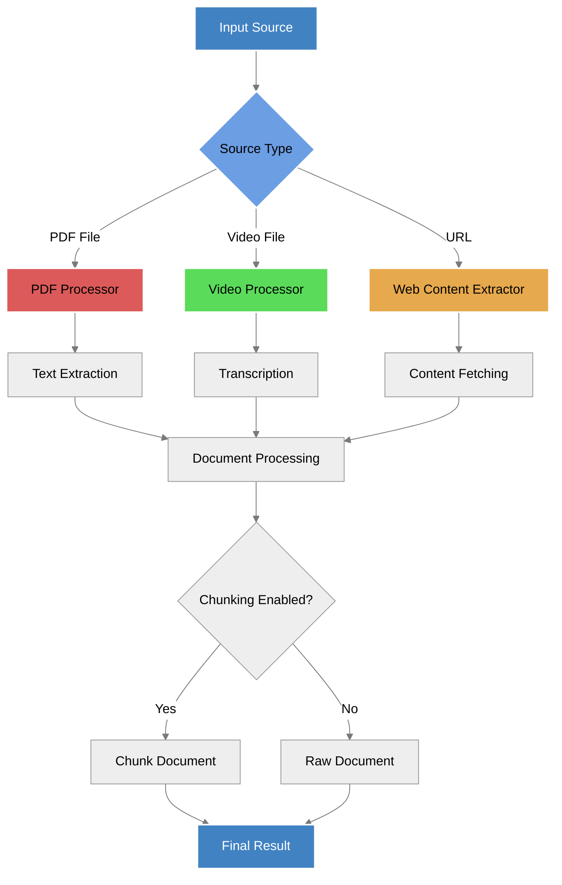
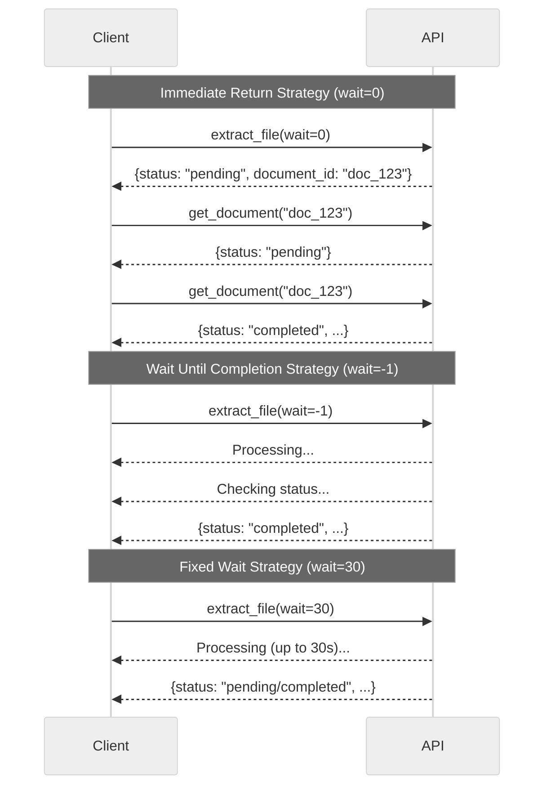

This guide provides technical details about processing different types of files with the Aurelio SDK, including PDFs, videos, and web content. It covers all available parameters, recommended configurations, and waiting strategies for large files.

## Processing Flow



## Common Parameters

All file extraction methods accept these core parameters:

| Parameter | Type | Default | Description |
|-----------|------|---------|-------------|
| `model` | `"aurelio-base"` \| `"docling-base"` \| `"gemini-2-flash-lite"` | `"aurelio-base"` | Model to use for processing. Different models have different capabilities and price points. |
| `chunk` | `bool` | `True` | Whether to chunk the document using default chunking config. |
| `wait` | `int` | `30` | Time in seconds to wait for processing completion. Set to `-1` to wait indefinitely. Set to `0` to return immediately with a document ID. |
| `polling_interval` | `int` | `5` | Time in seconds between status check requests. Set to `0` to disable polling. |
| `retries` | `int` | `3` | Number of retry attempts in case of API errors (5xx). |
| `processing_options` | `dict` | `None` | Additional processing options for customizing extraction and chunking behavior. |

> **Note:** The `quality` parameter has been deprecated and replaced with the `model` parameter. 
> - For PDF: `quality="low"` is equivalent to `model="aurelio-base"` (fastest, cheapest, best for clean PDFs)
> - For PDF: `quality="high"` is equivalent to `model="docling-base"` (code-based OCR for high precision)
> - For PDF: A new option `model="gemini-2-flash-lite"` uses a **V**ision **L**anguage **M**odel (VLM) for state-of-the-art text extraction. Note that VLMs can offer superior PDF-to-text performance but come with the risk of hallucinating PDF content <sup>[Y. Liu, et al.](https://arxiv.org/html/2305.07895v5)</sup>
> - For MP4: Both quality settings used `"aurelio-base"` but with different chunking methods, now specified in `processing_options`
> - MP4 files can only be processed with `model="aurelio-base"`

## Processing from PDF Files

The SDK enables extracting text from PDF documents stored as local files.

### Method Signature

```python
def extract_file(
    self,
    file: Optional[Union[IO[bytes], bytes]] = None,
    file_path: Optional[Union[str, pathlib.Path]] = None,
    model: Literal["aurelio-base", "docling-base", "gemini-2-flash-lite"] = "aurelio-base",
    chunk: bool = True,
    wait: int = 30,
    polling_interval: int = 5,
    retries: int = 3,
    processing_options: Optional[Dict[str, Any]] = None,
) -> ExtractResponse:
    """Process a document from a file synchronously."""
```

### Usage Examples

#### From a file path:

```python
from aurelio_sdk import AurelioClient

client = AurelioClient()
response = client.extract_file(
    file_path="path/to/document.pdf",
    model="aurelio-base",  # Fastest and cheapest option, best for clean PDF files
    chunk=True,
    wait=30
)
```

#### From file bytes:

```python
with open("path/to/document.pdf", "rb") as f:
    file_bytes = f.read()

file_bytes_io = io.BytesIO(file_bytes)
file_bytes_io.name = "document.pdf"  # Name is important for content type detection

response = client.extract_file(
    file=file_bytes_io,
    model="docling-base",  # Better for complex documents requiring high precision
    chunk=True,
    wait=-1  # Wait until completion
)
```

### PDF Processing Recommendations

- Use `model="aurelio-base"` for faster processing of simple documents (equivalent to old `quality="low"`)
- Use `model="docling-base"` for complex documents with tables, diagrams, or mixed layouts (equivalent to old `quality="high"`)
- Use `model="gemini-2-flash-lite"` for state-of-the-art text extraction using a Vision Language Model
- For large PDFs (>100 pages) or image-heavy PDFs, consider increasing `wait` time or using `-1`
- The SDK automatically handles pagination and merges content across pages

## Processing from Video Files

The SDK can extract transcriptions from video files (MP4 format).

### Usage Examples

```python
response = client.extract_file(
    file_path="path/to/video.mp4",
    model="aurelio-base",  # Only model supported for video processing
    chunk=True,
    wait=-1,         # Video processing can take longer
    polling_interval=15,
    processing_options={
        "chunking": {
            "chunker_type": "semantic"  # Use semantic chunking (previously achieved with quality="high")
        }
    }
)
```

### Video Processing Recommendations

- Only `model="aurelio-base"` is supported for video transcription
- Specify chunking preferences in `processing_options` (use "chunker_type": "semantic" for better chunking, equivalent to old `quality="high"`)
- Set `wait=-1` for videos longer than 5 minutes
- Use a longer `polling_interval` (15-30 seconds) for videos to reduce API calls
- Video processing is more resource-intensive and may take several minutes for longer files

## Processing from URLs

Extract content from web-based URLs, including PDF documents and webpages.

### Method Signature

```python
def extract_url(
    self,
    url: str,
    model: Literal["aurelio-base", "docling-base", "gemini-2-flash-lite"],
    chunk: bool,
    wait: int = 30,
    polling_interval: int = 5,
    retries: int = 3,
    processing_options: Optional[Dict[str, Any]] = None,
) -> ExtractResponse:
    """Process a document from a URL synchronously."""
```

### Usage Examples

```python
# PDF URL
pdf_response = client.extract_url(
    url="https://example.com/document.pdf",
    model="aurelio-base",
    chunk=True,
    wait=30
)

# Web page URL
webpage_response = client.extract_url(
    url="https://example.com/blog/article",
    model="docling-base",
    chunk=True,
    wait=30
)

# Video URL (only supports aurelio-base)
video_response = client.extract_url(
    url="https://example.com/video.mp4",
    model="aurelio-base",
    chunk=True,
    wait=60,
    processing_options={
        "chunking": {
            "chunker_type": "semantic"
        }
    }
)
```

### URL Processing Recommendations

- For PDF URLs, follow the same model recommendations as for PDF files
- For web pages, use `model="docling-base"` to better preserve page structure
- For video URLs, only `model="aurelio-base"` is supported
- When extracting from dynamic websites, be aware that client-side rendered content may not be fully captured

## Waiting Strategies for Large Files

Processing large files (extensive PDFs or long videos) requires appropriate waiting strategies to handle longer processing times.



### Recommended Strategies

1. **Immediate Return (`wait=0`):**
   - Best for very large files where you want to process asynchronously
   - You must handle polling separately
   - Good for user-facing applications to avoid blocking

2. **Wait Until Completion (`wait=-1`):**
   - Simplest approach for backend processing
   - Blocks until processing completes
   - Use `polling_interval` to control how frequently to check status
   - Best for batch processing jobs or automation

3. **Fixed Wait Time (`wait=30`):**
   - Wait for a predefined time (default 30 seconds)
   - Returns with whatever status is available after that time
   - Good for medium-sized files where you expect processing to be quick

### Example: Progressive Polling with Timeout

For large files with uncertain processing times, implement a progressive polling strategy:

```python
from aurelio_sdk import AurelioClient, TaskStatus

client = AurelioClient()

# First request returns immediately with document ID
response = client.extract_file(
    file_path="large_document.pdf",
    model="docling-base",
    chunk=True,
    wait=0
)

document_id = response.document.id
status = response.status
total_wait_time = 0
max_wait_time = 300  # 5 minutes
polling_interval = 10  # Start polling every 10 seconds

while status == TaskStatus.pending and total_wait_time < max_wait_time:
    # Wait before polling again
    time.sleep(polling_interval)
    total_wait_time += polling_interval
    
    # Get document status
    response = client.get_document(document_id)
    status = response.status
    
    # Increase polling interval for longer waits
    if total_wait_time > 60:
        polling_interval = 30
    
    print(f"Waited {total_wait_time}s, status: {status}")

if status == TaskStatus.completed:
    print("Processing completed successfully")
    document = response.document
else:
    print(f"Processing incomplete after {total_wait_time}s")
```

## Response Structure

The `ExtractResponse` object contains detailed information about the processed document:

```python
class ExtractResponse(BaseModel):
    status: TaskStatus  # "pending", "completed", or "failed"
    usage: Usage        # Resource usage information
    message: Optional[str]  # Additional information (e.g., errors)
    processing_options: ExtractProcessingOptions  # Applied options
    document: ResponseDocument  # The processed document
```

The `ResponseDocument` contains:

```python
class ResponseDocument(BaseModel):
    id: str           # Document ID
    content: str      # Full document content
    source: str       # Source filename or URL
    source_type: SourceType  # MIME type (application/pdf, video/mp4, etc.)
    num_chunks: int   # Number of chunks if chunking was enabled
    metadata: Dict[str, Any]  # User-definable metadata
    chunks: List[ResponseChunk]  # List of document chunks
```

## Error Handling

The SDK can raise several exceptions during file processing:

- `APITimeoutError`: Raised when the request exceeds the wait time
- `APIError`: General API error with details in the message
- `ApiRateLimitError`: Raised when API rate limits are exceeded

Example error handling:

```python
from aurelio_sdk import AurelioClient, APIError, APITimeoutError, ApiRateLimitError

client = AurelioClient()

try:
    response = client.extract_file(
        file_path="document.pdf",
        model="docling-base",
        chunk=True,
        wait=30
    )
except APITimeoutError:
    print("Processing is taking longer than expected")
except ApiRateLimitError:
    print("Rate limit exceeded, try again later")
except APIError as e:
    print(f"API error: {e.message}")
``` 